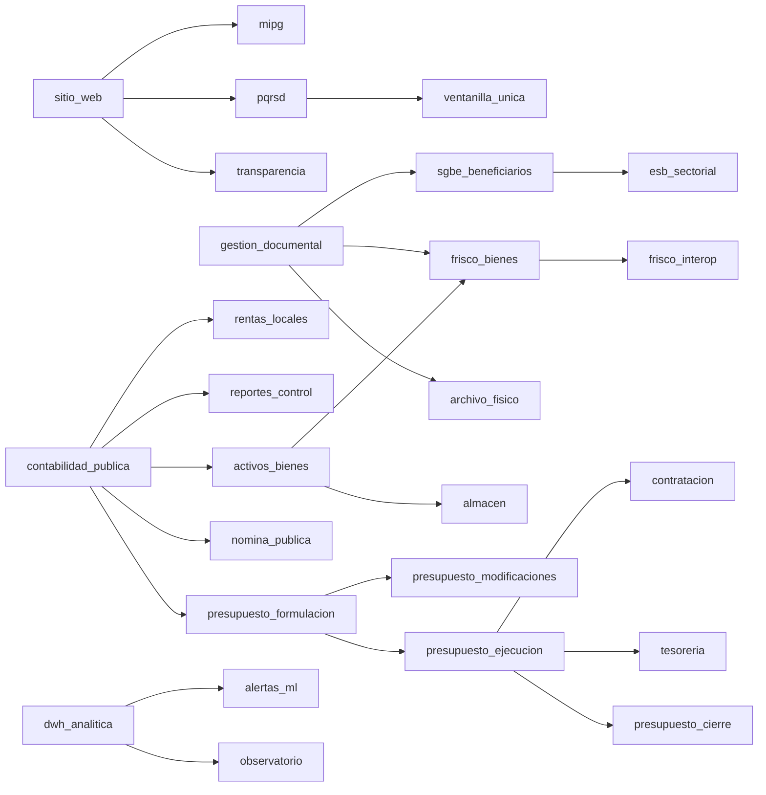
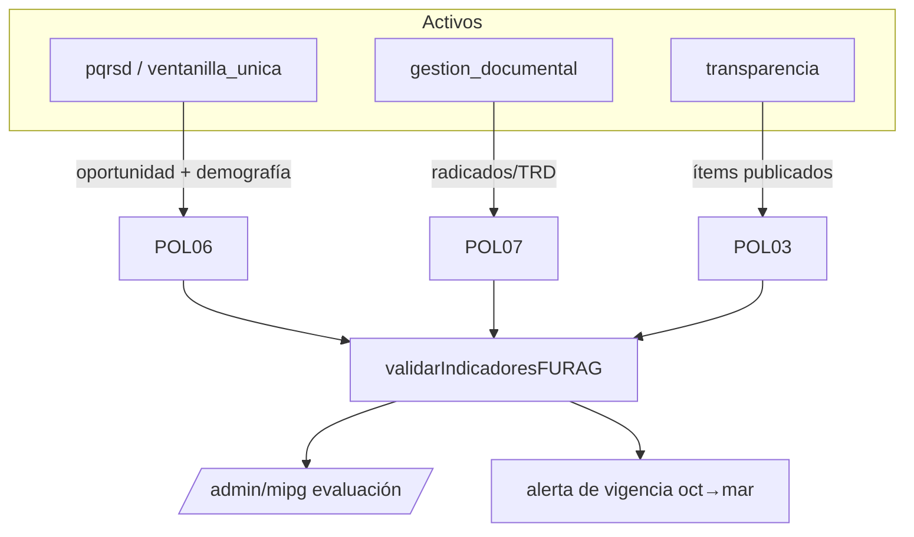
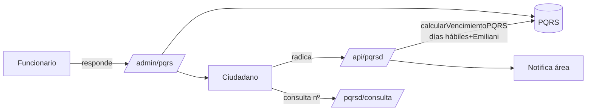
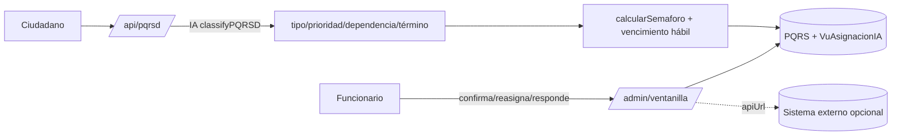
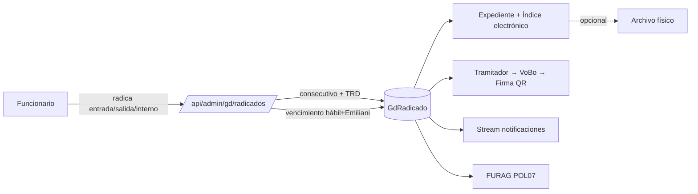
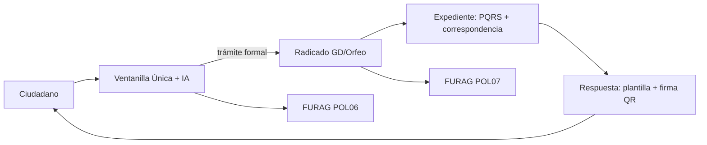
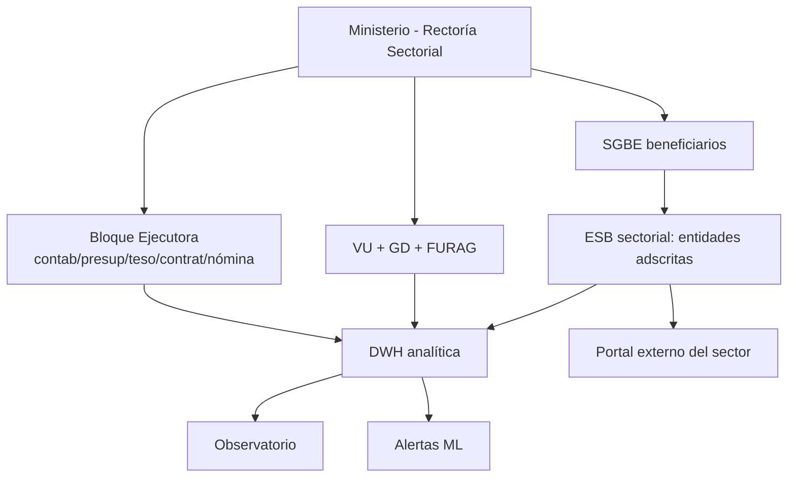
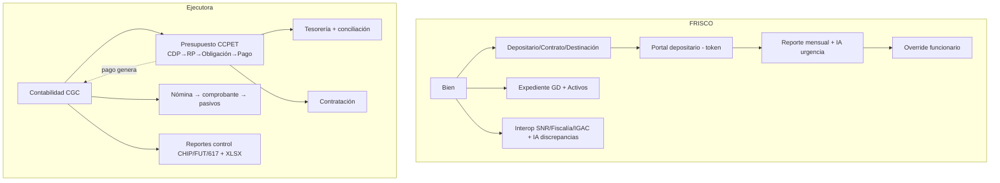

# Flujos por escenario de contratación

> Fuente de verdad: `src/lib/modules.ts` (catálogo de 29 módulos, dependencias, tiers),
> `src/lib/module-bundles.ts` (ediciones comerciales) y las rutas reales bajo `src/app`.
> Cada escenario indica: **módulos activos**, **resumen funcional** y **flujo operativo
> end‑to‑end** con diagrama. La Ley Emiliani (festivos + traslado a lunes) aplica a todos
> los **plazos en días hábiles** vía `src/lib/dias-habiles.ts`.

---

## 0. Núcleo que SIEMPRE se instala

En `MODULOS_DEFAULT` solo tres módulos vienen `activo: true` para todo tenant
(más la plataforma transversal que no es "módulo" activable):

| Capa | Componente | Qué aporta |
|---|---|---|
| Plataforma | Autenticación / roles | `SUPER_ADMIN, ADMIN, EDITOR, USER`. Login admin + superadmin. |
| Plataforma | Superadmin multi‑tenant | Alta de tenant, activación de módulos por tenant, BD por tenant, auto‑siembra de catálogos. |
| Plataforma | Auditoría base | Log de eventos sensibles del tenant. |
| **Núcleo** | `sitio_web` (CMS) | Portal Gov.co: páginas, menú, noticias, slider, banners, configuración del sitio. |
| **Núcleo** | `transparencia` | Sección Ley 1712: categorías e ítems, documentos de transparencia. Depende de `sitio_web`. |
| **Núcleo** | `pqrsd` | PQRSD ciudadano básico: radicación, vencimiento en días hábiles (Ley 1755/2015 + Emiliani), consulta pública, respuesta. Depende de `sitio_web`. |

Todo lo demás está **inactivo** hasta que el superadmin lo habilite (o se aplique un bundle).

### Ediciones comerciales (bundles) — `module-bundles.ts`

| Edición | Perfiles | Módulos sobre el núcleo |
|---|---|---|
| **Control** | Personería, Defensoría, Contraloría, Procuraduría | `ventanilla_unica`, `gestion_documental`, `archivo_fisico`, `mipg`, `auditoria_avanzada` |
| **Ejecutora** | SAE, Alcaldía, Establecimiento público, Agencia | Control **+** `contabilidad_publica`, `presupuesto_*` (formulación/ejecución/modificaciones/cierre), `tesoreria`, `contratacion`, `nomina_publica`, `activos_bienes`, `almacen`, `reportes_control`, `integraciones_estado` |
| **Rectoría Sectorial** | Ministerio, sector administrativo | Ejecutora **+** `sgbe_beneficiarios`, `esb_sectorial`, `dwh_analitica`, `observatorio`, `alertas_ml`, `portal_externo` |

### Grafo de dependencias (resumen)

> Regla del sistema (`areDepsActive`): un módulo no se activa si sus dependencias no están activas.
> Al activar `contabilidad_publica`/`presupuesto_ejecucion`/`nomina_publica` se **auto‑siembran**
> los catálogos oficiales (CGC 3.745 cuentas, CCPET 1.784 rubros, 24 conceptos de nómina).

---

## FURAG (transversal a MIPG)

FURAG no es un módulo aparte: vive dentro de **`mipg`** (`src/lib/furag-validator.ts`,
`furag-alertas.ts`, rutas `api/admin/mipg/*`). Valida indicadores MIPG y **se alimenta de los
módulos que estén activos**:

| Indicador FURAG | Política MIPG | Fuente de datos | Requiere |
|---|---|---|---|
| POL06 — Atención al ciudadano | Atención | PQRSD oportuna + cobertura demográfica | `pqrsd` (mejor con `ventanilla_unica`) |
| POL07 — Gestión documental | Documental | Radicados, TRD, expedientes | `gestion_documental` |
| POL03 — Transparencia | Transparencia | Ítems Ley 1712 publicados | `transparencia` |

Más la **alerta de vigencia FURAG** (ventana DAFP oct→mar, niveles INFORMATIVA→VENCIDA),
con fechas calculadas en UTC para no desbordarse de día.

> **Cuantos más módulos activos, más indicadores FURAG auto‑alimentados.** Una entidad solo
> con núcleo cubre POL03 y parte de POL06; con VU mejora POL06 (demografía); con GD cubre POL07.
> FURAG requiere que el módulo `mipg` esté activo (incluido desde la edición Control).

---

## Escenario A — Entidad normal (sin Ventanilla Única, sin GD)

**Módulos activos:** núcleo (`sitio_web`, `transparencia`, `pqrsd`). *Edición: solo núcleo.*

### Funcional
Portal institucional Gov.co + sección de transparencia + PQRSD ciudadano básico.
La entidad publica contenido, atiende PQRSD con términos legales y responde.

### Operativo (PQRSD básico)
1. **Ciudadano** entra al portal (`/atencion-ciudadano/pqrsd`) y radica una PQRSD.
2. `POST /api/pqrsd` → genera número de radicado y calcula `fechaVencimiento` con
   `calcularVencimientoPQRS(tipo, hoy)` → **días hábiles + Ley Emiliani** (`dias-habiles.ts`).
3. Se persiste la PQRS y se notifica (email) al área responsable (dependencia receptora por defecto).
4. **Ciudadano** consulta el estado en `/atencion-ciudadano/pqrsd/consulta` con su número.
5. **Funcionario** responde desde `/admin/pqrs`; al responder se registra la respuesta y se
   notifica al ciudadano. El semáforo de vencimiento se compara contra la fecha (días hábiles).
6. **Transparencia/CMS:** el admin publica páginas, noticias y los ítems de Ley 1712.

**FURAG en A:** POL03 (transparencia) y POL06 básico (oportunidad PQRSD). Sin demografía ni POL07.
Requiere activar `mipg` para reportar.

---

## Escenario B — Entidad que contrata Ventanilla Única

**Módulos activos:** núcleo **+ `ventanilla_unica`** (depende de `pqrsd`).

### Funcional
La Ventanilla Única **reemplaza/enriquece** el PQRSD básico: clasificación con IA,
semáforo CPACA/Ley 1437, asignación a funcionarios, tipos de respuesta formales,
demografía FURAG y, opcionalmente, **delegación a un sistema externo** (campo `apiUrl`).

### Operativo
1. **Ciudadano** radica igual que en A (`POST /api/pqrsd`); se calcula `fechaVencimiento`
   en días hábiles (Emiliani).
2. Como VU está activo, se ejecuta `classifyPQRSD` (**IA: Groq → Shipu → fallback**) que sugiere
   **tipo, prioridad, dependencia y funcionario y término legal**.
3. Se calcula `calcularSemaforo` (color CPACA) y se recalcula la fecha límite con
   `calcularFechaVencimientoHabil` (**días hábiles + Emiliani**); se guarda la sugerencia en `VuAsignacionIA`.
4. **Funcionario/Supervisor** en `/admin/ventanilla`: confirma o corrige la asignación
   (IA sugiere, humano decide), reasigna (`/[id]/reasignar`) y responde (`/[id]/responder`)
   con uno de los 6 tipos de respuesta (competente, remisión, traslado, etc.).
5. Si el tenant configuró `apiUrl`, la navegación de Ventanilla apunta al **sistema externo**
   (delegación); si no, se usa el módulo nativo.
6. La **demografía** capturada alimenta FURAG POL06.

**FURAG en B:** POL06 reforzado (oportunidad + **demografía**) + POL03.

---

## Escenario C — Entidad que contrata Gestión Documental

**Módulos activos:** núcleo **+ `gestion_documental`** (y opcional `archivo_fisico`, que depende de GD).

### Funcional
Gestión documental tipo **Orfeo NG / AGN**: ventanilla de radicación de toda la
correspondencia (no solo PQRSD), TRD (dependencia→serie→subserie), expedientes,
índice electrónico, firmas QR, VoBo, plantillas y, si se contrata, archivo físico.

### Operativo
1. **Ventanilla/funcionario** radica un documento (entrada / salida / interno) en `/admin/gd`
   → `POST /api/admin/gd/radicados`.
2. Se asigna **consecutivo** y se clasifica por **TRD**; se calcula `fechaVencimiento` con
   `calcularFechaVencimientoHabil` → **días hábiles + Ley Emiliani**.
3. Se asocia a **expediente** (y opcionalmente a **carpeta física** si `archivo_fisico` activo).
4. Se enruta a un **tramitador**; flujo de estados (EN_TRAMITE → PENDIENTE_VOBO → …) con **VoBo**.
5. **Firma QR** y **plantillas** para documentos de salida; **índice electrónico** del expediente.
6. **Notificaciones** en tiempo real (`/api/admin/gd/notificaciones/stream`) avisan de radicados
   próximos a vencer y asignaciones.
7. **BI / FURAG POL07** consume radicados/TRD para indicadores documentales.

**FURAG en C:** POL07 (gestión documental) + POL03.

---

## Escenario D — Ventanilla Única + Gestión Documental

**Módulos activos:** núcleo **+ `ventanilla_unica` + `gestion_documental`** (+ `archivo_fisico` opcional).

### Funcional
La atención ciudadana (VU, con IA y semáforo) y la gestión documental institucional (GD/Orfeo)
operan juntas: una PQRSD que requiere trámite formal **se radica en GD** y queda trazada
extremo a extremo, con FURAG cubriendo POL06 **y** POL07.

### Operativo
1. **Ciudadano** radica PQRSD → VU clasifica con IA, asigna y fija semáforo + vencimiento hábil (Emiliani).
2. Si la PQRSD deriva en trámite documental (oficios, traslados, respuesta formal), el funcionario
   genera el **radicado GD** asociado; el expediente vincula la PQRS con su correspondencia.
3. La respuesta formal usa **plantillas + firma QR** de GD; el vencimiento de ambos (PQRS y radicado)
   se calcula en **días hábiles + Emiliani**, consistente entre módulos.
4. Cierre del expediente → índice electrónico; archivo físico si está activo.
5. **FURAG** consolida POL06 (atención + demografía) y POL07 (documental).

**FURAG en D:** POL03 + POL06 (completo) + POL07 → cobertura de atención y documental.

---

## Escenario E — Ministerio de la Igualdad y entidades adscritas

**Edición:** **Rectoría Sectorial**. Módulos: núcleo + Control + Ejecutora + `sgbe_beneficiarios`,
`esb_sectorial`, `dwh_analitica`, `observatorio`, `alertas_ml`, `portal_externo`.
(`esb_sectorial` depende de `sgbe_beneficiarios`, que depende de `gestion_documental`;
`entidadesObjetivo` del vertical sectorial = `MINISTERIO`.)

### Funcional
El ministerio actúa como **rector de sector**: además de operar como entidad ejecutora
(presupuesto/contabilidad/contratación/nómina/tesorería), orquesta **beneficiarios** (SGBE)
y el **esquema sectorial** (ESB) de sus entidades adscritas, con **analítica de política pública**
(DWH + observatorio + alertas ML) y **portales externos** para actores del sector.

### Operativo
1. **Atención + documental** (VU + GD) y **FURAG** como en D, a escala ministerial.
2. **Gestión financiera completa** (ver escenario F, bloque Ejecutora): contabilidad CGC,
   presupuesto CCPET (CDP→RP→Obligación→Pago), tesorería, contratación, nómina, reportes de control.
3. **SGBE — beneficiarios:** registro y gestión de beneficiarios del sector (depende de GD para soporte documental).
4. **ESB sectorial:** esquema/estructura sectorial que agrega entidades adscritas sobre SGBE.
5. **DWH + Observatorio + Alertas ML:** consolidación analítica de los datos del sector y de las
   adscritas → tableros de observatorio y alertas predictivas de política pública.
6. **Portal externo:** acceso de actores/entidades del sector a sus datos.

**FURAG en E:** cobertura completa (POL03/POL06/POL07) por entidad, con consolidación analítica sectorial.

---

## Escenario F — SAE (Sociedad de Activos Especiales)

**Edición:** **Ejecutora** + verticales **FRISCO**. Módulos: núcleo + Control + Ejecutora
**+ `frisco_bienes` (+ `frisco_interop`, `portal_externo`)**.
(`frisco_bienes` depende de `gestion_documental` **y** `activos_bienes`; `frisco_interop` depende
de `frisco_bienes`; `entidadesObjetivo` = `AGENCIA`/`OTRO`.)

### Funcional
SAE administra **bienes en proceso de extinción de dominio / FRISCO** con custodia por depositarios,
contratos, destinación, interoperabilidad con entes externos y un **portal del depositario** para
reportes mensuales; todo sobre la base financiera ejecutora y la gestión documental.

### Operativo
**Vertical FRISCO**
1. Registrar **bien** (`/admin/frisco`) → vincularlo a **expediente GD** y a **activos/bienes**.
2. Asignar **depositario** (custodio), **contrato** y **destinación** (relación 1:1 bien↔destinación).
3. **Interoperabilidad** (`frisco_interop`): consultar **SNR / Fiscalía / IGAC**; la IA cruza
   respuestas y resalta **discrepancias** (severidad INFO/ALERTA/CRÍTICA) + resumen del proceso.
4. **Portal externo del depositario** (acceso por token, sin contraseña): el depositario presenta
   su **reporte mensual** (estado del bien, novedades).
5. **IA del reporte** clasifica urgencia (NORMAL/ATENCIÓN/CRÍTICA) y etiqueta; el funcionario
   hace **override** (IA sugiere, humano decide).

**Bloque Ejecutora (financiero)**
6. **Contabilidad** CGC (doble partida, periodos, comprobantes, balance).
7. **Presupuesto** CCPET: **CDP → RP → Obligación → Pago**; al pagar se genera comprobante contable.
8. **Tesorería:** cuentas, movimientos, extractos, conciliación.
9. **Contratación** (Ley 80/1150): procesos, contratos, adiciones/prórrogas.
10. **Nómina:** empleados, liquidación, pago→comprobante, pasivos a EPS/AFP/DIAN.
11. **Reportes de control:** CHIP, FUT, Ley 617 + exportador XLSX.

**FURAG en F:** POL03/POL06/POL07 según VU+GD activos; el foco operativo de SAE es el vertical
FRISCO + ejecución presupuestal, con reportes a entes de control (CHIP/FUT/617).

---

## Apéndice — matriz módulo × escenario

| Módulo | A (normal) | B (VU) | C (GD) | D (VU+GD) | E (MinIgualdad) | F (SAE) |
|---|:--:|:--:|:--:|:--:|:--:|:--:|
| sitio_web / transparencia / pqrsd | ✓ | ✓ | ✓ | ✓ | ✓ | ✓ |
| ventanilla_unica | – | ✓ | – | ✓ | ✓ | ✓ |
| gestion_documental | – | – | ✓ | ✓ | ✓ | ✓ |
| archivo_fisico | – | – | opc | opc | ✓ | ✓ |
| mipg + FURAG | opc | opc | opc | opc | ✓ | ✓ |
| auditoria_avanzada | – | – | – | – | ✓ | ✓ |
| contabilidad/presupuesto/tesorería/contratación/nómina | – | – | – | – | ✓ | ✓ |
| activos_bienes / almacen | – | – | – | – | ✓ | ✓ |
| reportes_control | – | – | – | – | ✓ | ✓ |
| frisco_bienes / frisco_interop | – | – | – | – | – | ✓ |
| sgbe_beneficiarios / esb_sectorial | – | – | – | – | ✓ | – |
| dwh_analitica / observatorio / alertas_ml | – | – | – | – | ✓ | opc |
| portal_externo | – | – | – | – | ✓ | ✓ |

`✓` activo · `opc` opcional según contratación · `–` no aplica.
