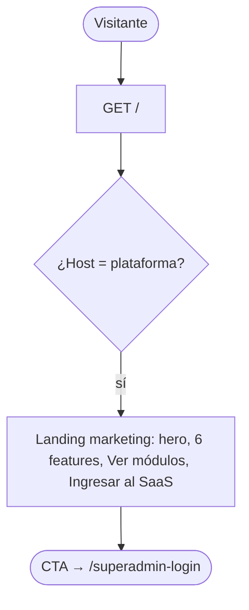
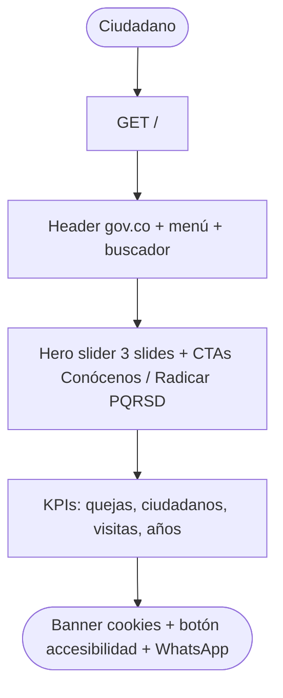
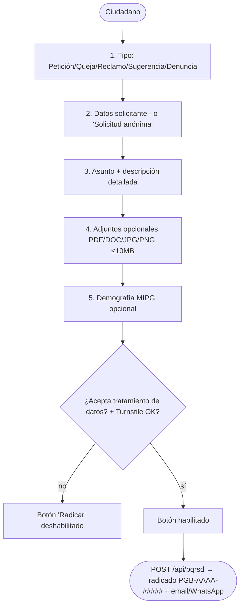
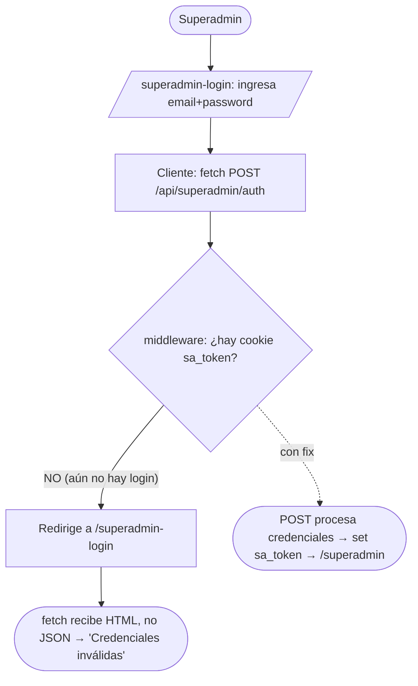

# Informe de prueba funcional — OSS Government One / Personería de Buga

**Fecha:** 2026-06-27 · **Entorno:** Producción (Vercel) · **Probado por:** Claude Code (browser-driven, Chrome MCP)
**Alcance:** Completo · **Profundidad:** Funcional (con cautela en escrituras irreversibles de producción)

## URLs
- **Landing SaaS (plataforma):** https://ossgovernmentone.lat/ → solo marketing + `Ingresar al SaaS` (`/superadmin-login`).
- **Portal tenant (Personería de Buga):** https://personeria-buga.ossgovernmentone.lat/
- **Dominio institucional:** https://personeriabuga.gov.co/ (HTTP 200, apunta al mismo portal)

> ⚠️ **Hallazgo de enrutamiento (a verificar):** subdominios arbitrarios no registrados
> (`buga.ossgovernmentone.lat`, `personeriabuga.ossgovernmentone.lat`) también responden 200 con el
> portal de Buga. Puede ser wildcard `*.ossgovernmentone.lat` resolviendo al único tenant, o matching
> de dominio demasiado laxo en `getTenantByDomainEdge`. Revisar `src/lib/tenant-edge.ts`.

---

## Resumen ejecutivo
- **Funcionalidades probadas:** portal público del tenant (11 secciones), PQRSD (radicar+consultar),
  panel admin CMS (~22 rutas + 1 CRUD escrito), panel superadmin (login + dashboard + alta de tenant), gestión (carga).
- **Estado general:** 🟡 El **portal ciudadano y el CMS admin funcionan**. Hay **1 bug crítico** que dejaba
  el **superadmin inaccesible en producción** (ya con fix validado) y **1 riesgo de seguridad alto** (captcha PQRSD desactivado).
- **Hallazgos por severidad:** 🔴 Crítico: 1 · 🟠 Alto: 2 · 🟡 Medio: 3 · ⚪ Bajo: 3.
- **Top 5 urgentes:**
  1. 🔴 **Superadmin login roto en prod** (middleware gatea su propio endpoint de auth) — fix de 1 línea listo, desplegar.
  2. 🟠 **Turnstile con sitekey de prueba en prod** (`page.tsx:595`) — captcha anti-bot del PQRSD desactivado.
  3. 🟠 **Ráfagas de 503 en prefetch RSC** — probable agotamiento de conexiones Neon / concurrencia serverless.
  4. 🟡 **Rol legacy "Funcionario PQRS"** con nombre fuera del enum → rompería autorización.
  5. 🟡 **Directorio de funcionarios vacío** (info obligatoria de transparencia) + datos de contenido faltantes.

### Backlog priorizado
| ID | Tipo | Sev | Funcionalidad | Descripción | Archivo/ruta |
|----|------|-----|---------------|-------------|--------------|
| B01 | 🐞 Bug | 🔴 Crítico | Superadmin login | El middleware redirige `POST /api/superadmin/auth` (no hay token aún) → imposible loguearse. Verificado en prod (opaqueredirect) | `src/middleware.ts:42` |
| B02 | 🐞 Bug/Seg | 🟠 Alto | PQRSD radicar | Turnstile con sitekey dummy `1x0000…AA` hardcodeada → captcha desactivado en prod | `src/app/atencion-ciudadano/pqrsd/page.tsx:595` |
| B03 | 🐞 Bug | 🟠 Alto | Plataforma (RSC) | Prefetch RSC devuelve 503 en ráfaga (Neon pool/concurrencia) | pooling Prisma/Neon; `prefetch`/cache |
| B04 | 🐞 Bug | 🟡 Medio | Auth/roles | Rol "Funcionario PQRS" con nombre ≠ enum → `requireRoles` falla (500/403) | seed roles / migración meta |
| B05 | ⚠️ Datos | 🟡 Medio | Transparencia | Directorio de funcionarios vacío (Res.1519 ítem 1.3) | cargar vía `/admin/contenido/funcionarios` |
| B06 | ⚙️ Config | 🟡 Medio | Enrutamiento | Subdominios arbitrarios resuelven al mismo tenant **porque `TENANT_SLUG` está seteado en prod (modo single-tenant)**. No es bug de código; quitar `TENANT_SLUG` en Vercel al ser multi-tenant | Vercel env `TENANT_SLUG` |
| B07 | 🐞 Bug | ⚪ Bajo | Portal (todas) | `GET /api/configuracion?clave=whatsapp` → 404 en cada carga (en prod; local 200) | `src/app/api/configuracion/route.ts:35` (devolver 200 + valor null) |
| B08 | ⚠️ UX | ⚪ Bajo | Consultar PQRSD | Ejemplo de formato `PQR-12345678` ≠ real `PGB-AAAA-#####` | `/atencion-ciudadano/pqrsd/consulta` |
| ~~B09~~ | ✅ No es bug | — | Sidebar admin | **Falso positivo:** `admin-sidebar.tsx:529` ya filtra ítems por módulo activo; no aparecen si están inactivos. El redirect por URL directa es correcto | — |

### Cobertura y datos de prueba
- **Cubierto:** portal público (tenant), PQRSD, login admin, ~22 rutas admin, CRUD FAQ, login superadmin + dashboard + alta tenant (form).
- **No cubierto a fondo:** módulos verticales (inactivos en tenant; activarlos = escritura en meta prod), flujo de responder PQRS/VU (sin radicados de prueba), `/buscar`, `/verificar`, accesibilidad, responsive móvil, Chat IA widget.
- **Datos QA creados** (BD **dev**, no prod): 1 FAQ "QA…", usuarios editor/consulta, superadmin por env, reset de pass del admin. Limpiar si se desea.
- **Nota de entorno:** Vercel/prod usa BD de tenant distinta al `.env` local (la meta sí es compartida). Captcha y SMTP de prod sin verificar a fondo.

---

## Hallazgo transversal P0 — ráfaga de 503 en prefetch RSC
En casi toda navegación, Next.js dispara prefetch de los links visibles (`GET /ruta?_rsc=...`).
Una parte significativa de esos prefetch responde **503 Service Unavailable** (observado en `/`,
`/entidad`, `/transparencia`, `/noticias`, `/servicios`, `/participa`, `/atencion-ciudadano`,
`/privacidad`, `/mapa-sitio`, `/accesibilidad`, `/entidad/directorio`, `/entidad/funciones`).
Las **navegaciones completas** (GET de la página) sí responden 200 — por eso el usuario rara vez lo
nota (Next cae a navegación normal). Pero indica que el backend **no soporta render concurrente** de
varios server components a la vez.
- **Causa probable:** agotamiento de conexiones a Neon (Postgres serverless) o límite de concurrencia
  de funciones en Vercel; cada RSC re-renderiza un server component que consulta la BD del tenant.
- **Severidad:** 🟠 Alto (riesgo de escalabilidad / picos de tráfico; ruido en logs; degradación percibida).
- **Sugerencia:** revisar pooling de Prisma/Neon (usar pooled connection + límite), `export const dynamic`
  / revalidate para cachear páginas mayormente estáticas, y considerar `prefetch={false}` en links no críticos.

---

## Detalle por funcionalidad

### [Plataforma] — Landing SaaS (raíz)  ·  `https://ossgovernmentone.lat/`

| # | Paso | Resultado | Veredicto |
|---|------|-----------|-----------|
| 1 | GET / | 200, landing "Government One" renderiza | ✅ OK |
| 2 | Links | `Ingresar al SaaS`→`/superadmin-login`, `Ver módulos`→`#modulos` | ✅ OK |

**Hallazgos:** ⚠️ [bajo] La landing es mínima; "Ver módulos" sólo hace scroll a un ancla. Sin pie de página/legales propios de la plataforma. (Branding pendiente según bitácora.)
**Veredicto:** ✅ OK.

### [Ciudadano] — Portal home tenant  ·  `https://personeria-buga.ossgovernmentone.lat/`

| # | Paso | Resultado | Veredicto |
|---|------|-----------|-----------|
| 1 | GET / | 200; gov.co header, menú 7 ítems, hero, stats, footer | ✅ OK |
| 2 | `GET /api/tenant/modulos`, `/api/auth/session` | 200 | ✅ OK |
| 3 | `GET /api/configuracion?clave=whatsapp` | **404** (en cada carga) | 🐞 Bug bajo |
| 4 | Banner cookies "CONTINUAR" | cierra | ✅ OK |

**Hallazgos:**
- 🐞 **[bajo] 404 recurrente `/api/configuracion?clave=whatsapp`** en cada página. El endpoint
  devuelve 404 cuando la clave no está configurada (`route.ts:35-40`). El componente lo maneja
  (cae a defaults) pero ensucia consola/red en toda carga. **Fix:** devolver 200 con `{valor:null}`
  para clave inexistente, o precargar config whatsapp. Archivo: `src/app/api/configuracion/route.ts`.
**Veredicto:** ✅ OK (con ruido 404 menor).

### [Ciudadano] — La Entidad y subpáginas  ·  `/entidad`, `/entidad/directorio`, …
| # | Paso | Resultado | Veredicto |
|---|------|-----------|-----------|
| 1 | GET /entidad | 200; 5 tarjetas (Misión/Visión, Historia, Organigrama, Directorio, Funciones) | ✅ OK |
| 2 | GET /entidad/directorio | 200; layout OK pero **"Aún no hay funcionarios publicados"** | ⚠️ Contenido |

**Hallazgos:** ⚠️ **[medio] Directorio de funcionarios vacío** en producción — la entidad aún no
cargó funcionarios vía CMS (`/admin/contenido/funcionarios`). Estado vacío bien manejado, pero es
información obligatoria de transparencia (Res.1519, ítem 1.3). Acción: cargar datos.
**Veredicto:** ✅ OK funcional · ⚠️ falta contenido.

### [Ciudadano] — Transparencia  ·  `/transparencia`
| # | Paso | Resultado | Veredicto |
|---|------|-----------|-----------|
| 1 | GET /transparencia | 200; taxonomía Res.1519 (cat. 1-4+ con subcategorías), buscador | ✅ OK |

**Veredicto:** ✅ OK. (Pendiente validar profundidad de cada subcategoría y si tienen documentos cargados.)

### [Ciudadano] — Radicar PQRSD  ·  `/atencion-ciudadano/pqrsd`  ·  API `POST /api/pqrsd`

| # | Paso | Resultado | Veredicto |
|---|------|-----------|-----------|
| 1 | Seleccionar "Petición" | revela secciones 2-5 | ✅ OK |
| 2 | Estructura del formulario | completa, validaciones de obligatorios, opción anónima, MIPG | ✅ OK |
| 3 | Captcha Turnstile | muestra **"Success! For testing only. If seen, report to site owner"** | 🐞 Bug ALTO |
| 4 | Gating del botón | deshabilitado hasta marcar consentimiento → se habilita | ✅ OK |
| 5 | Envío real (POST) | **NO ejecutado** (producción: crearía radicado real + notificaría) | ⛔ Límite prod |

**Hallazgos:**
- 🐞 **[ALTO/seguridad] Turnstile con sitekey de PRUEBA en producción.** `src/app/atencion-ciudadano/pqrsd/page.tsx:595`
  tiene `siteKey="1x00000000000000000000AA"` **hardcodeada** (dummy de Cloudflare que siempre pasa),
  con comentario que lo reconoce como provisional. `.env.example` ya define `NEXT_PUBLIC_TURNSTILE_SITE_KEY`.
  Efecto: la protección anti-bot del PQRSD está **desactivada** → spam masivo de radicados posible.
  **Fix:** usar `process.env.NEXT_PUBLIC_TURNSTILE_SITE_KEY` + configurar llaves reales (site+secret) en Vercel.
  Verificar además `TURNSTILE_SECRET_KEY` en backend (`src/app/api/pqrsd/route.ts:415`): si tiene secret
  real, el token dummy del frontend **fallaría** la verificación (posible 403 al radicar) → doble riesgo.
**Veredicto:** ✅ flujo correcto hasta el envío · 🐞 bug de seguridad en captcha · ⛔ submit no ejecutado en prod.

### [Ciudadano] — Consultar PQRSD  ·  `/atencion-ciudadano/pqrsd/consulta`
| # | Paso | Resultado | Veredicto |
|---|------|-----------|-----------|
| 1 | GET consulta | 200; campo radicado + instrucciones | ✅ OK |
| 2 | Consultar radicado inexistente (PGB-2026-00001) | "Radicado no encontrado" (error claro) | ✅ OK |

**Hallazgos:** ⚠️ **[bajo] Formato de ejemplo inconsistente.** El placeholder/instrucciones dicen
`PQR-12345678` / `PQR-XXXXXXXX`, pero los radicados reales son `PGB-AAAA-#####` (ver `e2e/helpers.ts`
`parseRadicado` y generación en API). Confunde al ciudadano. **Fix:** alinear el ejemplo a `PGB-2026-00001`.
**Veredicto:** ✅ OK.

### [Ciudadano] — Otras secciones públicas (sweep)
| Sección | Ruta | Resultado | Veredicto |
|---|------|-----------|-----------|
| Noticias | `/noticias` | 200; destacada + filtros por categoría + listado con contenido real | ✅ OK |
| Servicios | `/servicios` | 200; servicios destacados (Asesoría jurídica, Tutelas, PQRSD) + catálogo | ✅ OK |
| Participa | `/participa` | 200; "Menú Participa" MIPG con 6 espacios | ✅ OK |
| Atención al Ciudadano | `/atencion-ciudadano` | 200; accesos Radicar/Consultar + tipos con plazos legales | ✅ OK |

Sin errores de consola en ninguna. Pendientes de barrer en cierre: `/transparencia/[categoria]` (profundidad),
`/buscar`, `/verificar`, `/accesibilidad`, `/mapa-sitio`, legales, Chat IA widget, y responsive móvil.

---

## 🔴 HALLAZGO CRÍTICO — Login de Superadmin roto en producción (chicken-and-egg)

**El panel de plataforma (`/superadmin`) es inaccesible: nadie puede autenticarse.**



- **Causa raíz:** `src/middleware.ts:42` gatea **toda** ruta `/api/superadmin/*` exigiendo `sa_token`,
  pero el endpoint que **emite** ese token (`POST /api/superadmin/auth`) está dentro de ese gate.
  Sin token (situación normal antes de loguearse) el POST se redirige al login → el cliente recibe HTML
  en vez de JSON → siempre "Credenciales inválidas". **Imposible obtener el token.**
- **Verificado en PRODUCCIÓN:** `fetch('/api/superadmin/auth',{method:'POST',redirect:'manual'})` en
  `https://ossgovernmentone.lat/superadmin-login` devuelve `type:"opaqueredirect"` (status 0) en vez de
  401 JSON → confirmado que el sitio en vivo está afectado.
- **Severidad:** 🔴 **Crítico** — toda la administración de la plataforma (alta de tenants, módulos por
  contrato, superadmins, informes) está fuera de servicio. Explica por qué no había forma de entrar.
- **Fix (aplicado y validado en local):** excluir el endpoint de login del gate en `src/middleware.ts`:
  ```ts
  const SA_PUBLIC_PATHS = ["/superadmin-login", "/api/superadmin/auth"]
  if (!saSession && !SA_PUBLIC_PATHS.includes(pathname)) { /* redirect */ }
  ```
  Tras el fix: `POST /api/superadmin/auth → 200` + `GET /superadmin → 200` (login exitoso, panel carga).
  **Pendiente: desplegar este cambio a producción.**

> ⚠️ Cambio de código realizado por QA: este fix de 1 línea quedó aplicado en el repo local
> (`src/middleware.ts`) para poder probar el panel. Revisar y desplegar (o revertir) según se decida.

---

## [Admin/Editor] — Panel CMS (`/admin`)
**Entorno de prueba:** por pérdida de credenciales y porque el `.env` apunta a una BD **dev** distinta
de la de producción, el panel se probó corriendo la app **localmente** (mismo código que prod) contra esa
BD dev, con credenciales QA sembradas. Login admin: ✅ `POST /api/auth/callback/credentials → 200` → `/admin 200`.

**Cuentas QA creadas** (BD dev): `admin@personeriabuga.gov.co` (SUPER_ADMIN, pass reseteada),
`editor.qa@oss.local` (EDITOR), `consulta.qa@oss.local` (USER), `superadmin@oss.local` (superadmin vía ENV).

**Barrido de rutas admin (todas autenticadas):**
| Resultado | Rutas |
|---|---|
| ✅ 200 | `/admin`, `/admin/contenido/{identidad,sedes,canales,faqs,funcionarios}`, `/admin/noticias`, `/admin/paginas`, `/admin/slider`, `/admin/documentos`, `/admin/pqrs`, `/admin/gd`, `/admin/transparencia`, `/admin/menu`, `/admin/mipg`, `/admin/mipg/{evidencias,evaluacion}`, `/admin/usuarios`, `/admin/estadisticas`, `/admin/configuracion`, `/admin/ajustes/apariencia`, `/admin/ventanilla` |
| ↪️ Redirige a `/admin` (gated) | `/admin/auditoria`, `/admin/observatorio` (módulo/permiso no activo) |
| ↪️ Redirige (módulo inactivo en tenant) | verticales: `/admin/{frisco,contabilidad,presupuesto,nomina,disc,reportes-control,tesoreria,contratacion,activos,rentas,almacen}` |
| ✅ 200 | `/admin/chat-ia` |

Sin 500s. Gating de módulos inactivos = correcto (redirige al dashboard, no rompe).

**Flujo de escritura validado (CRUD) — Crear FAQ:**
```mermaid
flowchart TD
  A([Admin]) --> F[/admin/contenido/faqs → 'Nueva FAQ']
  F --> Fill[Categoría + orden + pregunta + respuesta + publicada]
  Fill --> Save{Guardar}
  Save --> API[POST /api/admin/contenido/faqs]
  API --> OK([201 Created → FAQ visible en la lista])
```
Resultado: `POST /api/admin/contenido/faqs → 201`, la FAQ "QA - Pregunta de prueba…" aparece en la lista. ✅ OK.
Módulo Usuarios: muestra correctamente los 3 usuarios con su rol. ✅ OK.

**Veredicto admin:** ✅ Núcleo CMS funcional (login, navegación de ~22 módulos, CRUD, gating). Verticales
no probados a fondo por estar **inactivos** en el tenant dev (activarlos escribe en la meta-DB compartida con prod → evitado).

## [Superadmin] — Panel de plataforma (`/superadmin`)
| # | Paso | Resultado | Veredicto |
|---|------|-----------|-----------|
| 1 | Login (tras fix middleware) | `POST /api/superadmin/auth 200` → `/superadmin 200` | ✅ OK (con fix) |
| 2 | Dashboard | KPIs (1 entidad, 1 activa, distribución por plan), nav Tenants/Superadmins/Auditoría/Informes IA | ✅ OK |
| 3 | "Registrar nueva entidad" | Formulario completo: slug, NIT, DIVIPOLA, dominios, databaseUrl, plan, módulos, contacto, branding, API keys, SMTP | ✅ OK (render) |
| 4 | Crear tenant (submit) | **No ejecutado** — escribiría en meta-DB compartida con prod; provisioning auto requiere `NEON_API_KEY` | ⛔ Límite prod |

**Hallazgos:**
- 🔴 Crítico: login roto (sección anterior).
- 🔎 La **meta-DB del `.env` es la de producción** (contiene el tenant Buga real) — cualquier escritura de
  superadmin afecta el sitio en vivo. Documentado para evitar cambios accidentales.
- ⚠️ [medio] Existe el rol legacy **"Funcionario PQRS"** cuyo `nombre` no es uno de los 4 del enum
  (`SUPER_ADMIN/ADMIN/EDITOR/USER`); un usuario con ese rol rompería `requireRoles` (500/403). Renombrar o migrar.

## [Gestión] — Módulos de gestión
`/admin/pqrs` (bandeja PQRSD), `/admin/gd` (gestor documental), `/admin/ventanilla`, `/admin/mipg` → todos **200** y renderizan. No se probó el flujo completo de responder PQRS/VU por falta de radicados de prueba en la BD dev (requeriría sembrar uno). Cobertura: carga + render OK; flujo de respuesta pendiente.


